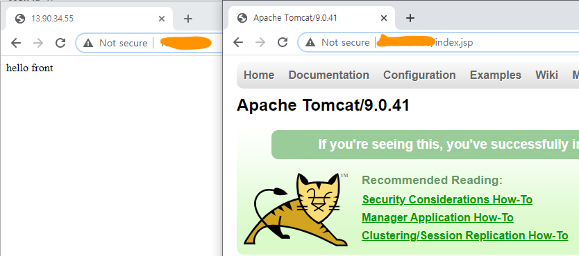
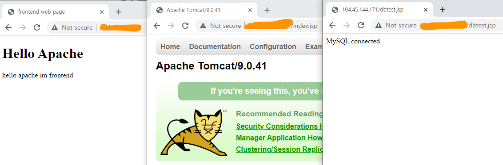

# Web-Was-DB in Azure

## Web(Apache) ←→ Was(Tomcat) ←→DB(MySQL)

Off SELinux (vi /etc/selinux/config and reboot) or setenforce 0

### Infra Setup

- Network
    - Vnet CIDR: 10.0.0.0/8
    - Subnet
        - Web CIDR: 10.1.0.0/16
        - Was CIDR: 10.2.0.0/16
        - DB CIDR: 10.3.0.0/16
- Web,Was
    - Virtual Machine: Azure VM
        - OS: CentOS8
        - Size: Standard_D1_v2
    - Aoache Version: 2.4.6
    - Tomcat Version: 9.0.41
    - MySQL Version: community 5.7

## 1. Web(Apache) ←→ Was(Tomcat) 구성

### Web(Apache)

1. 필요 패키지 설치

    ```bash
    yum install httpd httpd-devel gcc gcc-c++
    ```

2. tomcat-connector 설치(mod_jk.so 생성)

    ```bash
    wget http://apache.mirror.cdnetworks.com/tomcat/tomcat-connectors/jk/tomcat-connectors-1.2.48-src.tar.gz
    tar zxvf tomcat-connectors-1.2.48-src.tar.gz
    cd tomcat-connectors-1.2.48-src/native/
    ./configure --with-apxs=/bin/apxs
    make # 컴파일
    make install # 설치
    ```

3. (Optional) /usr/lib64/httpd/modules/mod_jk.so 파일이 존재하지 않을 경우 아래 내용 실행

    보통 설치 완료되면 /etc/httpd/modules/밑에 mod_jk.so 생성됨

    ```bash
    cp -p mod_jk.so /usr/lib64/httpd/modules/mod_jk.so
    chmod 755 /usr/lib64/httpd/modules/mod_jk.so
    ```

4. /etc/httpd/conf/httpd.conf 파일 수정
    - LoadModule은  conf/httpd.conf에 작성
    - <IfModule>안의 설정내용은  conf.d/mod_jk.conf 에 만들어서  httpd.conf에서 불러와도 됨
    - [worker.propertie](http://worker.properties)s 는 conf/  밑에 위치

    ```bash
    LoadModule jk_module /usr/lib64/httpd/modules/mod_jk.so
    # 혹은
    LoadModule jk_module modules/mod_jk.so
    # mod_jk.so 가 있는 경로 입력

    # .jsp 파일에 대해서 tomcat 서버로 보냄(추가 설정 가능)
    # 아래 내용을 conf.d에 파일로 만들어서 Include 해도됨
    <IfModule jk_module>
    	JkWorkersFile /etc/httpd/conf/workers.properties # worker파일의 경로
    	JkLogFile /var/log/httpd/mod_jk.log
    	JkLogLevel info
    	JkLogStampFormat "[%a %b %d %H:%M:%S %Y]"
    	JkMount /*.jsp worker1 # jsp파일은 톰캣으로 보낸다
    </IfModule>

    # 만약 mod_jk.conf를 conf.d에 만들어서 불러오고 싶을땐
    <IfModule jk_module>
    Include conf.d/mod_jk.conf
    </IfModule>
    ```

5. /etc/httpd/conf/workers.properties 파일 생성 후 편집

    tomcat의 연동방법을 기술하는 내용, mod_jk의 설정값에  이 파일의 경로가 추가됨

    ```bash
    worker.list=worker1

    worker.worker1.type=ajp13
    worker.worker1.host=[톰캣 서버의 IP]
    worker.worker1.port=8009 #8009는 톰캣서버의 server.xml에 서 정의된 커넥터 포트와 일치시켜주면 됨
    ```

6. httpd start

    ```bash
    systemctl enable --now httpd
    ```

### Was(Tomcat)

1. JDK Setup

    ```bash
    # JDK 설치
    yum -y update
    yum install java-1.8.0-openjdk-devel.x86_64

    # JDK 환경 변수 설정
    vi /etc/profile

    JAVA_HOME=/usr/lib/jvm/java-1.8.0-openjdk-1.8.0.242.b08-0.el7_7.x86_64
    export JAVA_HOME
    PATH=$PATH:$JAVA_HOME/bin
    export PATH

    # 설정 내용 적용
    source /etc/profile

    # 1.8.0 으로 재대로 출력 되는지 확인
    java -version
    ```

2. Install Tomcat

    ```bash
    wget https://downloads.apache.org/tomcat/tomcat-9/v9.0.41/bin/apache-tomcat-9.0.41.tar.gz
    tar zxvf apache-tomcat-9.0.41.tar.gz
    mv apache-tomcat-9.0.41 /usr/local/tomcat9
    ```

3. server.xml 편집

    /usr/local/tomcat9/conf/server.xml

    ```bash
    # 116~121 라인 주석 제거
    <Connector protocol="AJP/1.3"
               address="0.0.0.0" # 모든 소스 IP
               secretRequired="false" # SSL OFF
               port="8009" # 웹서버 worker에 설정한 포트
               redirectPort="8443" /> 
    #Azure에서 작업시 nsg에 위에 나열된 port 개방 필요

    ```

4. Start Tomcat (꼭 root권한으로 해줘야  포트가 개방됨)

    ```bash
    /usr/local/tomcat9/bin/startup.sh
    ```

    8080, 8009에 프로세스가 listen중인지 확인 필요

    ```bash
    netstat -nltp
    ```

- 왼쪽은 Apache  오른쪽은 Tomcat

    

    Apache와 Tomcat

- Issue

    jsp파일을 불러와도 css파일과 이미지 파일이 같이 오지 않는 문제 방생

    Apache가 jsp 파일을 tomcat에서 받아와도 그안의 css와 이미지 들을 자신의 DocumentRoot에서 찾으려 하므로 css와 이미지가 깨짐

    Apache와 Tomcat이 DocumentRoot를 공유해야하는지??

    각각 따로 DocumentRoot를 갖도록 하고싶음

- Solution

    webserver의  apache 설정파일인 /etc/httpd/conf/httpd.conf 내용 수정

    ```bash
    LoadModule jk_module modules/mod_jk.so
    <IfModule jk_module>
    	JkWorkersFile /etc/httpd/conf/workers.properties 
    	JkLogFile /var/log/httpd/mod_jk.log
    	JkLogLevel info
    	JkLogStampFormat "[%a %b %d %H:%M:%S %Y]"
    	
    	JkMount /*.jsp worker1
      JKMount /*.css worker1
      JKMount /*.svg worker1
      JKMount /*.png worker1
      JKMount /*.gif worker1
      JKMount /*.do worker1 
    </IfModule>
    ```

    

### Ref. Web(Apache) ←→ Was(Tomcat) 연결 방법

1. tomcat connector(mod.jk) 방식

    [[Tomcat] apache - tomcat 설치 및 물리적 망분리/연동 설정 (SSL 사용X, apache 2.4.6 설치, tomcat 9.0.36 설치, tomcat 8.5.51 설치)](https://nirsa.tistory.com/132)

    [아파치 웹 서버(apache httpd) 와 톰캣 연동하기 - tomcat connector(mod_jk) , reverse proxy(mod_proxy)](https://www.lesstif.com/system-admin/apache-httpd-tomcat-connector-mod_jk-reverse-proxy-mod_proxy-12943367.html)

    [[Apache & TOMCAT 연동 4] mod_jk로 아파치/톰캣 연동](https://m.blog.naver.com/PostView.nhn?blogId=tawoo0&logNo=221587063882&proxyReferer=https:%2F%2Fwww.google.com%2F)

### Database(MySQL) Server

1. MySQL 설치

    ```bash
    # 저장소 설치 - MySQL 5.7
    yum -y install http://dev.mysql.com/get/mysql57-community-release-el7-11.noarch.rpm

    # MySQL 설치
    yum -y install mysql-community-server

    # mysql 서비스 시작
    systemctl enable --now mysqld

    # root 비밀번호 확인
    grep password /var/log/mysqld.log  
    4gxTysdMgu)r
    # secure 설정
    sudo mysql_secure_installation

    # login (변경한 패스워드 입력)
    mysql -u root -p

    ```

2. MySQL config 설정
    - characterset - utf8 set up
        - mysql status 확인

            ```bash
            # mysql 설치 후 기본적으로 characterset이 latin1 셋팅
            # latin1 -> utf8로 변경
            mysql> status
            --------------
            mysql  Ver 14.14 Distrib 5.7.32, for Linux (x86_64) using  EditLine wrapper

            Connection id:          14
            Current database:
            Current user:           root@localhost
            SSL:                    Not in use
            Current pager:          stdout
            Using outfile:          ''
            Using delimiter:        ;
            Server version:         5.7.32 MySQL Community Server (GPL)
            Protocol version:       10
            Connection:             Localhost via UNIX socket
            Server characterset:    latin1
            Db     characterset:    latin1
            Client characterset:    latin1
            Conn.  characterset:    latin1
            UNIX socket:            /var/lib/mysql/mysql.sock
            Uptime:                 5 min 6 sec
            ```

    - vi /etc/my.cnf

        ```bash
        [mysqld]

        datadir=/var/lib/mysql
        socket=/var/lib/mysql/mysql.sock

        character-set-server=utf8
        collation-server=utf8_general_ci
        init_connect=SET collation_connection = utf8_general_ci
        init_connect=SET NAMES uft8

        character-set-client-handshake = FALSE
        skip-character-set-client-handshake

        # Disabling symbolic-links is recommended to prevent assorted security risks
        symbolic-links=0

        log-error=/var/log/mysqld.log
        pid-file=/var/run/mysqld/mysqld.pid

        [client]
        default-character-set = utf8

        [mysql]
        default-character-set = utf8
        ```

    - Restart mysqld

        ```bash
        systemctl restart mysqld
        ```

3. Database에 접근할 Tomcat User Setting

    ```bash
    # tomcat_db 라는 새로운 database 생성
    mysql> CREATE DATABASE DB_NAME;

    # 새로운 유저 tomcat_db 생성
    # 'tomcat_db'@'%' 에서 '%'는 모든 호스트를 허용한다는 뜻
    mysql> CREATE USER 'tomcat_db'@'%' IDENTIFIED BY 'PASSWORD';

    #새로운 사용자(tomcat_db)에게 mysql의 모든 데이터베이스에대한 액세스 권한 부여
    mysql> GRANT ALL PRIVILEGES ON *.* TO 'tomcat_db'@'%';

    # 권한 동기화
    mysql> FLUSH PRIVILEGES;
    ```

### Return to Tomcat Server

1. JDBC Driver - mysql-connector-java.jar 설치

    ```bash
    # connector 설치
    yum -y install mysql-connector-java

    # 설치 위치 확인
    rpm -ql mysql-connector-java

    # tomcat 홈 디렉토리의 lib 밑으로 복사
    # tomcat home = /usr/local/tomcat9 
    cp /usr/share/java/mysql-connector-java.jar /usr/local/tomcat9/lib/
    ```

2. test db jsp 파일 생성 

    vi /usr/local/tomcat9/webapps/ROOT/dbtest.jsp

    ```bash
    <%@ page import="java.sql.*" contentType="text/html;charset=euc-kr"%>
    <%
                    String DB_URL = "jdbc:mysql://DB_SERVER_URL:3306/TARGET_DATABASE";
                    String DB_USER = "DB_USERNAME";
                    String DB_PASSWORD= "DB_USER_PASSWORD";

                    Connection conn;

                    Statement stmt;

                    try
                    {
                            Class.forName("org.gjt.mm.mysql.Driver");
                            conn = DriverManager.getConnection(DB_URL, DB_USER,DB_PASSWORD);
                            stmt = conn.createStatement();
                            conn.close();
                            out.println("MySQL connected");
                    }
                    catch(Exception e)
                    {
                            out.println(e);
                    }
    %>
    ```

### Result



web(apache)-was(tomcat)-db(mysql)

### Ref.

- mysql 설치

    [CentOS에 MySQL 설치](https://toma0912.tistory.com/64)

- mysql-tomcat connector

    [apache-tomcat(8.0.53), httpd, MySQL(5.7) 연동 (apm yum설치)](https://idchowto.com/?p=47187)

- jdbc 드라이버 문제

    [JDK + tomcat 설치](https://whiterussian.tistory.com/17)